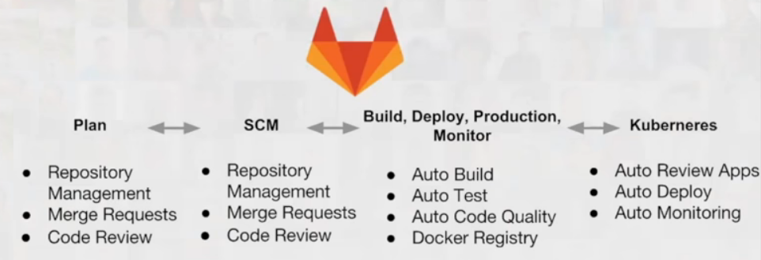

# Special Milestone: GitLab

## Team Members:
1. Karan Jadhav	(kjadhav) - Gitlab
2. Shashank Jha	(sjha5)	- Gitlab
3. Qiufeng Yu (qyu4) - Presentation
4. Bhavik Patel	(bcpatel) - Presentation

[Screencast](https://youtu.be/L9PxT4h6r9Y) 

[Click here for GitLab repo](https://gitlab.com/sshankjha/Chaos) 

In this milestone, we deployed checkbox using GitLab. It consisted of three stages, build, deploy to staging area and then deploy to production manually with just a single click.

## Why we decided to use GitLab?

GitLab is a single product for the complete DevOps lifecycle. So rather than using GitHub for version control, Jenkins for CI/CD, JIRA for issue tracking, etc, we can just use GitLab and reduce the toolchain complexity and speed up cycle times. It uses an open-source license as well.

### Features:

1. Free: It is completely free for unlimited users and unlimited private repositories. There is paid version for enterprise as well but most of the features are already available in free tier.

2. CI/CD: GitLab has in-built pipeline which can replace Jenkins. Hence, we can verify if the merge request will break our app or not.

3. Docker Registry: GitLab has in built registry which stores docker images. Hence, rather than using public registry at hub.docker.com, we can use this feature.

4. 3rd Party Integration: If one still wants to use 3rd party applications rather than using GitLab one, we can still use it as it supports integration for Jenkins, Slack, Google Cloud Platform, etc.

5. GitHub Features: Most of the features which are present in GitHub are already present here.

6. Kubernetes Support: With a built-in container registry and Kubernetes integration, GitLab makes it easier than ever to get started with containers and cloud native development. Also, canary deployments, monitoring, auto-devops, etc is possible because of this integration.
 
## Our Project:

For learning and demo purpose, we decided to deploy a dockerized version of [checkbox](https://github.com/chrisparnin/checkbox.io/) app. Our target was to learn more about dockers and different stages which can be added in GitLab's CI pipeline. Hence, we decided to build the docker image first and then deploy it in two area: staging and production. To achieve this, we added two files:

1. [Dockerfile](https://github.ncsu.edu/sjha5/SpecialMilestone/blob/master/Dockerfile) Here, all the commands required to assemble a docker image. Steps for installation of nodejs, mongodb and nginx are present here.

2. [.gitlab-ci.yml](https://github.ncsu.edu/sjha5/SpecialMilestone/blob/master/.gitlab-ci.yml): To take advantage of [GitLab's CI](https://about.gitlab.com/features/gitlab-ci-cd/), we need to add a `.gitlab-ci.yml` file to the root directory of our repository. For each commit, a runner (isolated machines) runs the code defined in `.gitlab-ci.yml.` In our case, we have three stages defined in the pipeline:

    a. build: Builds the docker image based on the [Dockerfile](https://github.ncsu.edu/sjha5/SpecialMilestone/blob/master/Dockerfile) and then pushes it to GitLab's registry.

    b. staging: Pulls image from registry, deletes any previous running docker container and then runs updated version.

    c. production: If we are satisfied with our application in staging area, we can push it to production area. Here also, we stop older version of our app and then deploy the latest one. Using `when: manual` in our 'production' stage allows us to perform a single click to deploy.

Since we are using single VM for running both staging and production steps, we had to assign different ports for them, ie, staging app will be available in 3000 port and production app will be available in 80 port. This can easily be changed as we are using Docker's port publish option.

## Difficulties Faced:

1. As GitLab is still not as popular as GitHub, we found it difficult to search for solutions. Most of the official guides present were for Ruby projects. Hence, working on nodejs project meant we had to put in extra effort.

2. [Auto-Devops](https://docs.gitlab.com/ee/topics/autodevops/#features) is still in beta version. With auto devops enabled, it automatically detects, builds, tests, deploys, and monitors our applications. Additionally, it does code quality check, dependency scanning, review apps, etc. However, as it is only in beta phase, support for nodejs projects is still limited. We tried to customize the auto devops pipeline to fit our project but lack of proper guides and examples meant that we had to skip this. However, we are sure that once they have fully supported auto devops feature, more and more people will start using GitLab.
  

## Future Plans:

Though we were able to achieve our inital target, we are yet to take full advantage of GitLab's features. For eg, we could have added test stage before deploying as well. Also, we want to use  [GitLab's Kubernetes Integration](https://about.gitlab.com/kubernetes/) as well. Deploying it in Kubernetes has the added advantage of easy scaling and having [canary release](https://docs.gitlab.com/ee/user/project/canary_deployments.html) as well. Hence, we will be working on these later for our learning purpose.
